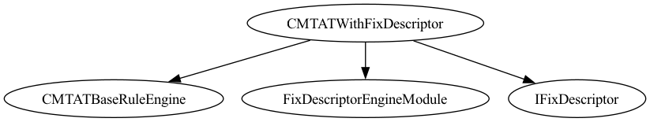
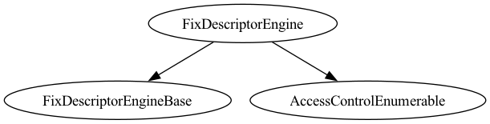
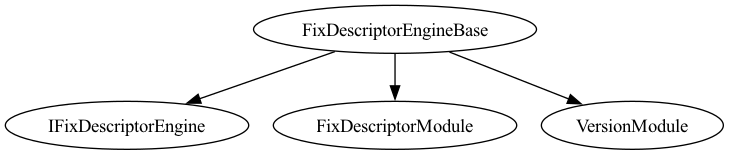

# CMTAT-FIX

Integration of FIX descriptor support for [CMTAT](https://github.com/CMTA/CMTAT) (The Capital Markets and Technology Association Token) contracts. This repository provides a modular engine system that enables CMTAT tokens to store, manage, and verify FIX (Financial Information eXchange) protocol descriptors on-chain.

This project was initially developed by [Nethermind](https://nethermind.io/) in collaboration with [CMTA](https://cmta.ch/) and [Taurus](https://www.taurushq.com/).

## Overview

CMTAT-FIX extends CMTAT tokens with FIX descriptor capabilities through a dedicated engine architecture. The system allows tokens to:

- Store FIX descriptor data using SBE (Simple Binary Encoding) format
- Commit to descriptor structures via Merkle roots
- Verify field values against committed descriptors using Merkle proofs
- Deploy descriptor data efficiently using SSTORE2 pattern

### How FIX messages are used to identify assets?

FIX (Financial Information eXchange) is the standard way traditional finance encode messages including describing instruments (e.g. Symbol, SecurityID, MaturityDate, Parties). Here, a **descriptor** is a FIX message (or subset) that identifies an asset. It is turned into a single, deterministic form, then committed on-chain so anyone can prove specific fields without the contract ever parsing FIX.

```
   FIX message (off-chain)          On-chain
   ─────────────────────           ────────
   Symbol, SecurityID,              fixRoot (Merkle root)
   MaturityDate, ...    ───────►    + SBE data (SSTORE2)
         │                         │
         ▼                         ▼
   canonical tree  ──►  SBE + Merkle tree   ──►  verify(path, value, proof)
   (sorted, stable)     (binary + commitment)        (no FIX parsing)
```

The contract stores only the Merkle root and SBE data; it never parses FIX. Verification is a separate call: callers supply path, value, and Merkle proof, and the contract checks the proof against the stored root.

Details (canonicalization, SBE encoding, Merkle rules, verification) are in the [FIX Descriptor Specification](https://fixdescriptor.vercel.app/spec).

### Terminology

| Term | Meaning |
|------|--------|
| **Descriptor** | The FIX message subset describing instrument characteristics (e.g. Symbol, SecurityID, MaturityDate, Parties). |
| **Canonical form** | Deterministic representation (sorted keys, consistent encoding) so all implementations agree. |
| **Path** | Location of a field in the tree (e.g. scalar `[55]` for Symbol, or `[453, 0, 448]` for first Party’s PartyID). On-chain, the path is passed as CBOR-encoded bytes (`pathCBOR`). |
| **SBE** | Simple Binary Encoding; efficient binary format for the descriptor. |
| **fixRoot** | Merkle root committing to all descriptor fields; stored onchain. |
| **Merkle proof** | Sibling hashes proving a (path, value) leaf under the stored fixRoot. |

## Security Notice

⚠️ **WARNING**: The contracts in this repository are **unaudited** and should be used with caution. They have not undergone formal security audits. Use at your own risk.

## Architecture

The repo is split into an **engine** (reusable for any compliant token) and **CMTAT integration** (module + example token).

### Engine (reusable)

The **FixDescriptorEngine** works with **any token** that implements `IFixDescriptorEngine` (e.g. `token()`); it is not tied to CMTAT. All engine code lives in `src/engine/`:

- **FixDescriptorEngine** / **FixDescriptorEngineBase** – Main contracts; one instance per token
- **interfaces/IFixDescriptorEngine.sol** – Minimum interface for binding
- **modules/FixDescriptorModule.sol** – Core descriptor logic (SBE, SSTORE2, Merkle verification)
- **modules/VersionModule.sol** – Version tracking

### CMTAT integration

- **FixDescriptorEngineModule** (`src/`) – CMTAT module that plugs the engine into a CMTAT token (ERC-7201 storage, engine reference); reusable by any CMTAT token
- **CMTATWithFixDescriptor** (`src/CMTAT/`) – Example CMTAT token using the module; forwards `IFixDescriptor` to the bound engine

### Design Principles

- **One Engine Per Token**: Each `FixDescriptorEngine` instance is bound to a single token at construction
- **Modular Architecture**: Engine can be attached/detached from tokens via module system
- **Gas Efficient**: Uses SSTORE2 for efficient on-chain data storage
- **Verifiable**: Merkle tree commitments enable cryptographic verification of descriptor fields

## Dependencies

- **CMTAT** [v3.2.0](https://github.com/CMTA/CMTAT/releases/tag/v3.2.0) - Core token framework
- **@fixdescriptorkit/contracts** ^1.0.2 - FIX descriptor library
- **@openzeppelin/contracts-upgradeable** [5.6.0](https://github.com/OpenZeppelin/openzeppelin-contracts-upgradeable/tree/v5.6.0) - Upgradeable contracts

### Foundry configuration

See `foundry.toml`:

- Solidity: [0.8.34](https://www.soliditylang.org/blog/2026/02/18/solidity-0.8.34-release-announcement)
- EVM version: `Prague`
- Lint:
    - `asm-keccak256` excluded (use of `keccak256()` is intentional)
    - We keep SBE & CBOR in identifiers per the [Solidity style guide](https://docs.soliditylang.org/en/latest/style-guide.html#naming-conventions) and the official specs: [SBE](https://www.fixtrading.org/standards/sbe/), [CBOR](https://cbor.io/).

## Installation

### Prerequisites

- Foundry (for development and testing)
- Node.js (for npm dependencies)

### Setup

1. Clone the repository with submodules:

```bash
git clone git@github.com:CMTA/CMTAT-FIX.git --recurse-submodules
cd CMTAT-FIX
```

2. Install npm dependencies:

```bash
npm install
```

3. Install Foundry dependencies:

```bash
forge install
```

## Architecture Diagrams

### CMTATWithFixDescriptor



#### Contracts Description Table


|          Contract          |             Type              |                            Bases                             |                |               |
| :------------------------: | :---------------------------: | :----------------------------------------------------------: | :------------: | :-----------: |
|             └              |       **Function Name**       |                        **Visibility**                        | **Mutability** | **Modifiers** |
|                            |                               |                                                              |                |               |
| **CMTATWithFixDescriptor** |        Implementation         | CMTATBaseRuleEngine, FixDescriptorEngineModule, IFixDescriptor |                |               |
|             └              |         <Constructor>         |                           Public ❗️                           |       🛑        |      NO❗️      |
|             └              |       getFixDescriptor        |                          External ❗️                          |                |      NO❗️      |
|             └              |          getFixRoot           |                          External ❗️                          |                |      NO❗️      |
|             └              |          verifyField          |                          External ❗️                          |                |      NO❗️      |
|             └              |        getFixSBEChunk         |                          External ❗️                          |                |      NO❗️      |
|             └              |      getDescriptorEngine      |                          External ❗️                          |                |      NO❗️      |
|             └              | _authorizeSetDescriptorEngine |                          Internal 🔒                          |       🛑        |   onlyRole    |
|             └              |       supportsInterface       |                           Public ❗️                           |                |      NO❗️      |
|             └              |     setDescriptorWithSBE      |                          External ❗️                          |       🛑        |   onlyRole    |
|             └              |         setDescriptor         |                          External ❗️                          |       🛑        |   onlyRole    |


##### Legend

| Symbol | Meaning                   |
| :----: | ------------------------- |
|   🛑    | Function can modify state |
|   💵    | Function is payable       |

### FixDescriptorEngine





See more in [./doc/surya](./doc/surya)

## API Reference

### FixDescriptorEngine

Main engine contract. One instance is bound to one token at construction time. Inherits `FixDescriptorEngineBase`, `AccessControlEnumerable`.

#### State Variables

| Name | Type | Description |
|------|------|-------------|
| `token` | `address` (immutable) | Address of the token this engine is bound to |
| `DESCRIPTOR_ADMIN_ROLE` | `bytes32` (constant) | Role required to set/update descriptors |

#### Functions

| Function | Signature | Access | Description |
|----------|-----------|--------|-------------|
| `constructor` | `(address token_, address admin, bytes sbeData_, FixDescriptor descriptor_)` | — | Binds engine to `token_`, grants `DEFAULT_ADMIN_ROLE` to `admin`. Optionally initializes descriptor from `sbeData_` / `descriptor_`. |
| `hasRole` | `(bytes32 role, address account) → bool` | public view | Override: `DEFAULT_ADMIN_ROLE` holders implicitly hold all roles. |
| `getFixDescriptor` | `() → FixDescriptor` | external view | Returns the stored FIX descriptor struct. |
| `getFixRoot` | `() → bytes32` | external view | Returns the Merkle root commitment of the descriptor. |
| `verifyField` | `(bytes pathCBOR, bytes value, bytes32[] proof, bool[] directions) → bool` | external view | Verifies a single FIX field value against the committed Merkle root. |
| `getFixSBEChunk` | `(uint256 start, uint256 size) → bytes` | external view | Reads a chunk of SBE-encoded data from SSTORE2 storage. |
| `setFixDescriptor` | `(FixDescriptor descriptor)` | external | Sets/updates the descriptor. Requires `DESCRIPTOR_ADMIN_ROLE` or caller is the bound token. |
| `setFixDescriptorWithSBE` | `(bytes sbeData, FixDescriptor descriptor) → address sbePtr` | external | Deploys SBE data via SSTORE2 and atomically updates the descriptor. Returns the deployed data contract address. Requires `DESCRIPTOR_ADMIN_ROLE` or caller is the bound token. |
| `version` | `() → string` | external pure | Returns the version string (e.g. `"1.0.0"`). |
| `getRoleMemberCount` | `(bytes32 role) → uint256` | public view | Returns the number of accounts with `role`. Inherited from `AccessControlEnumerable`. |
| `getRoleMember` | `(bytes32 role, uint256 index) → address` | public view | Returns the account at position `index` in the role's member set. Inherited from `AccessControlEnumerable`. |

---

### FixDescriptorEngineModule

CMTAT module that stores a reference to a `FixDescriptorEngine` on the token contract. Uses ERC-7201 namespaced storage.

#### State Variables

| Name | Type | Description |
|------|------|-------------|
| `DESCRIPTOR_ENGINE_ROLE` | `bytes32` (constant) | Role required to set the engine address on the token |

#### Functions

| Function | Signature | Access | Description |
|----------|-----------|--------|-------------|
| `setFixDescriptorEngine` | `(address engine)` | external | Sets the engine address. Verifies the engine is bound to this token (`engine.token() == address(this)`). Authorization is implementation-defined via `_authorizeSetDescriptorEngine()`. |
| `getDescriptorEngine` | `() → address` | external view | Returns the stored engine address, or `address(0)` if not set. |
| `fixDescriptorEngine` | `() → address` | public view | Alias for `getDescriptorEngine`. Used internally by `CMTATWithFixDescriptor`. |

---

### CMTATWithFixDescriptor

Example token implementation combining `CMTATBaseRuleEngine` with `FixDescriptorEngineModule`. All `IFixDescriptor` calls are forwarded to the bound engine.

#### State Variables

| Name | Type | Description |
|------|------|-------------|
| `DESCRIPTOR_ADMIN_ROLE` | `bytes32` (constant) | Role required to call descriptor write helpers on the token |

#### Functions

| Function | Signature | Access | Description |
|----------|-----------|--------|-------------|
| `getFixDescriptor` | `() → FixDescriptor` | external view | Forwarded to `FixDescriptorEngine.getFixDescriptor()`. Reverts if engine is not set. |
| `getFixRoot` | `() → bytes32` | external view | Forwarded to `FixDescriptorEngine.getFixRoot()`. Reverts if engine is not set. |
| `verifyField` | `(bytes pathCBOR, bytes value, bytes32[] proof, bool[] directions) → bool` | external view | Forwarded to `FixDescriptorEngine.verifyField()`. Reverts if engine is not set. |
| `getFixSBEChunk` | `(uint256 start, uint256 size) → bytes` | external view | Forwarded to `FixDescriptorEngine.getFixSBEChunk()`. Reverts if engine is not set. |
| `getDescriptorEngine` | `() → address` | external view | Returns the engine address (overrides both `FixDescriptorEngineModule` and `IFixDescriptor`). |
| `setDescriptorWithSBE` | `(bytes sbeData, FixDescriptor descriptor) → address sbePtr` | external | Convenience helper: calls `engine.setFixDescriptorWithSBE()`. Requires `DESCRIPTOR_ADMIN_ROLE`. |
| `setDescriptor` | `(FixDescriptor descriptor)` | external | Convenience helper: calls `engine.setFixDescriptor()`. Requires `DESCRIPTOR_ADMIN_ROLE`. |
| `supportsInterface` | `(bytes4 interfaceId) → bool` | public view | ERC-165 support. Returns `true` for `IFixDescriptor` in addition to inherited interfaces. |

## Usage

### Basic Integration

#### 1. Deploy the Token

```solidity
CMTATWithFixDescriptor implementation = new CMTATWithFixDescriptor();
ERC1967Proxy proxy = new ERC1967Proxy(address(implementation), "");
CMTATWithFixDescriptor token = CMTATWithFixDescriptor(address(proxy));
token.initialize(admin, erc20Attrs, extraInfo, engines);
```

#### 2. Deploy FixDescriptorEngine

**Option A: With Constructor Initialization**

```solidity
bytes memory sbeData = hex"...";
bytes32 merkleRoot = bytes32(...);
bytes32 schemaHash = keccak256("your-dictionary");

IFixDescriptor.FixDescriptor memory descriptor = IFixDescriptor.FixDescriptor({
    schemaHash: schemaHash,
    fixRoot: merkleRoot,
    fixSBEPtr: address(0),
    fixSBELen: 0,
    schemaURI: "ipfs://..."
});

FixDescriptorEngine engine = new FixDescriptorEngine(
    address(token),
    admin,
    sbeData,
    descriptor
);
```

**Option B: Post-Deployment Initialization**

```solidity
FixDescriptorEngine engine = new FixDescriptorEngine(
    address(token),
    admin,
    "",
    IFixDescriptor.FixDescriptor({
        schemaHash: bytes32(0),
        fixRoot: bytes32(0),
        fixSBEPtr: address(0),
        fixSBELen: 0,
        schemaURI: ""
    })
);

engine.setFixDescriptorWithSBE(sbeData, descriptor);
```

#### 3. Link Engine to Token

```solidity
// Caller must be authorized by token policy (typically DEFAULT_ADMIN_ROLE holder)
token.setFixDescriptorEngine(address(engine));
```

#### 4. Query Descriptor Information

```solidity
IFixDescriptor.FixDescriptor memory desc = token.getFixDescriptor();
bytes32 root = token.getFixRoot();
```

#### 5. Verify Field Values

```solidity
bytes calldata pathCBOR; // CBOR-encoded field path
bytes calldata value;   // Raw FIX value bytes
bytes32[] calldata proof; // Merkle proof
bool[] calldata directions; // Direction array

bool isValid = token.verifyField(pathCBOR, value, proof, directions);
```

### Advanced Usage

#### Updating Descriptors

```solidity
// Grant DESCRIPTOR_ADMIN_ROLE on engine
engine.grantRole(engine.DESCRIPTOR_ADMIN_ROLE(), admin);

// Update descriptor
IFixDescriptor.FixDescriptor memory newDescriptor = ...;
engine.setFixDescriptor(newDescriptor);

// Or deploy new SBE data and update
engine.setFixDescriptorWithSBE(newSbeData, newDescriptor);
```

#### Reading SBE Data

```solidity
// Read chunk of SBE data
bytes memory chunk = engine.getFixSBEChunk(startOffset, size);
```

## Project Structure

```
CMTAT-FIX/
├── .github/
│   └── workflows/
│       └── lint.yml                      # CI: forge lint (SBE/CBOR findings filtered)
├── src/
│   ├── engine/                           # Engine (reusable; works with any compliant token)
│   │   ├── FixDescriptorEngine.sol
│   │   ├── FixDescriptorEngineBase.sol
│   │   ├── interfaces/
│   │   │   └── IFixDescriptorEngine.sol
│   │   └── modules/
│   │       ├── FixDescriptorModule.sol
│   │       └── VersionModule.sol
│   ├── FixDescriptorEngineModule.sol     # CMTAT module (reusable)
│   └── CMTAT/                            # Example CMTAT token using the module
│       └── CMTATWithFixDescriptor.sol
├── lib/
│   └── CMTAT/                            # CMTAT submodule
├── test/
│   ├── CMTATWithFixDescriptor.t.sol
│   ├── FixDescriptorEngine.t.sol
│   ├── FixDescriptorEngineBase.t.sol
│   └── FixDescriptorEngineModule.t.sol
├── scripts/
│   └── DeployCMTATWithFixDescriptor.s.sol
├── foundry.toml
└── package.json
```

## Testing

Run the test suite using Foundry:

```bash
# Run all tests
forge test

# Run with verbosity
forge test -vvv

# Run specific test file
forge test --match-path test/CMTATWithFixDescriptor.t.sol
```

## Deployment

Use the provided deployment script:

```bash
forge script scripts/DeployCMTATWithFixDescriptor.s.sol:DeployCMTATWithFixDescriptor \
  --rpc-url $RPC_URL \
  --broadcast \
  --verify
```

Set environment variables:
- `PRIVATE_KEY` - Deployer private key
- `ADMIN_ADDRESS` - Admin address for roles
- `TOKEN_ADDRESS` - Deployed token/proxy address to bind the engine to

## Access Control

### Roles

- **DESCRIPTOR_ADMIN_ROLE** (on engine): Can set/update descriptors
- **DESCRIPTOR_ENGINE_ROLE** (on token): Can set the engine address
- **DEFAULT_ADMIN_ROLE** (on engine): Has all roles

### Role Resolution Behavior

- `FixDescriptorEngine.hasRole(...)` is overridden so any account with `DEFAULT_ADMIN_ROLE` is treated as having every role (including `DESCRIPTOR_ADMIN_ROLE`), even if not explicitly granted.
- `getRoleMember(...)` / `getRoleMemberCount(...)` from `AccessControlEnumerable` still report only explicitly granted members for each role.
- Operationally: role enumeration may omit default admins unless they are also explicitly granted that role.

### Permission Flow

1. Token caller authorized by token policy sets engine address (`DESCRIPTOR_ENGINE_ROLE` path)
2. Engine writes are allowed for `DESCRIPTOR_ADMIN_ROLE` and the bound token caller
3. Default admin on engine has all permissions

## Interface Compliance

The system implements the `IFixDescriptor` interface from `@fixdescriptorkit/contracts`, providing:

- `getFixDescriptor()` - Retrieve complete descriptor
- `getFixRoot()` - Get Merkle root commitment
- `verifyField()` - Verify field values with Merkle proofs
- `getDescriptorEngine()` - Get engine address

## Security Considerations

- Engine is bound to token at construction (immutable)
- Descriptor updates are authorized for `DESCRIPTOR_ADMIN_ROLE` and the bound token caller
- Merkle proofs enable cryptographic verification without revealing full descriptor
- SSTORE2 pattern ensures efficient and secure data storage

## Audit

### Tools


#### Slither

Report performed with [Slither](https://github.com/crytic/slither):

```bash
slither .  --checklist --filter-paths "openzeppelin-contracts|test|CMTAT|forge-std|mocks" > slither-report.md
```

| File | Report | Feedback |
|------|--------|----------|
| [`slither-report.md`](doc/audit/tools/slither-report.md) | No findings captured | - |

#### Aderyn

Report performed with [Aderyn](https://github.com/Cyfrin/aderyn):

```bash
aderyn -x mocks --output aderyn-report.md
```

| File | Report | Feedback |
|------|--------|----------|
| [`aderyn-report.md`](doc/audit/tools/aderyn-report.md) | 1 High, 4 Low | [`aderyn-report-feedback.md`](doc/audit/tools/aderyn-report-feedback.md) |

**Finding summary:**

| ID | Title | Aderyn Severity | Verdict |
|----|-------|-----------------|---------|
| H-1 | Contract Name Reused in Different Files | High | False Positive |
| L-1 | Centralization Risk | Low | Valid by Design / Acknowledge |
| L-2 | PUSH0 Opcode | Low | Conditional / N/A (Prague target) |
| L-3 | Unchecked Return | Low | False Positive |
| L-4 | Unspecific Solidity Pragma | Low | Valid by Design / Acknowledge |

### Forge coverage

```bash
forge coverage --no-match-coverage "(script|mocks|test)" --report lcov && genhtml lcov.info --branch-coverage --output-dir coverage
```

See [Solidity Coverage in VS Code with Foundry](https://mirror.xyz/devanon.eth/RrDvKPnlD-pmpuW7hQeR5wWdVjklrpOgPCOA-PJkWFU) & [Foundry forge coverage](https://www.rareskills.io/post/foundry-forge-coverage)

## License

Mozilla Public License 2.0 (MPL-2.0). See `LICENSE`.

## Contributing

Contributions are welcome! Please ensure:

- Code follows existing patterns and style
- Tests are added for new features
- Documentation is updated accordingly

## References

- [FIX Descriptor Specification](https://fixdescriptor.vercel.app/spec) – Canonicalization, SBE encoding, Merkle commitment, onchain verification
- [CMTAT Documentation](https://github.com/CMTA/CMTAT)
- [FIX Protocol](https://www.fixtrading.org/)
- [FixDescriptorKit](https://github.com/NethermindEth/fix-descriptor)
